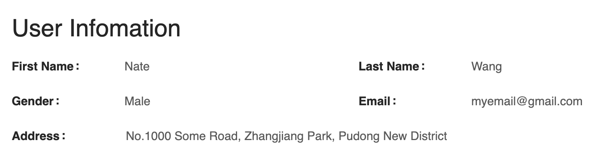
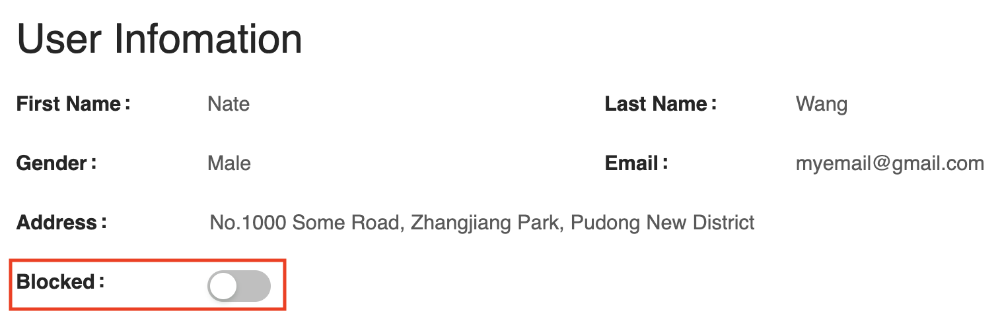

# Overview
[](https://www.npmjs.com/package/js-plugin)
[](https://app.travis-ci.com/github/rekit/js-plugin)

[js-plugin](https://www.npmjs.com/package/js-plugin) is a general and simple plugin engine for creating extensible and maintainable JavaScript applications for both browser and nodejs.

[](https://opencollective.com/rekit)

# Motivation
Web applications are becoming more and more complicated nowadays. To separate concerns, decouple business logic, a large application should be well designed. One of best practices is plugin based architecture. Whenever you add a new feature, it should not add much complication to the system so that the project could be always maintainable when it grows.

Every plugin in the system maybe not bundled separatly but just a logical plugin. Below two cases show the advantages of plugin based architecture.

## Example 1: Menu
Menu is used to navigate among functions of an application. Whenever you add a new feature, it may need a menu item in the menu. Say that we have a menu component like below (from Github settings page):


```js
import React from 'react';

export default function Menu() {
  return (
    <ul>
      <li>Profile<li>
      <li>Account<li>
      <li>Security<li>
    </ul>
  );
}
```

Now we need to add a new feature to allow to block users. It needs a menu item named 'Blocked users' in settings page. Normallly we need to change `Menu` component:
```js
return (
  <ul>
    <li>Profile<li>
    <li>Account<li>
    <li>Security<li>
    <li>Blocked Users<li>
  </ul>
);
```

It looks quite intuitive but it's not extensible. Whenever we add features to the application, we need to change `Menu` component and finally it will become too complicated to maintain. Especially if the menu item is dynamically like it needs to be show or not to show according to the permission. We have to embed the permission logic in `Menu` component. For example: if the block user feature is only available for premium users:

```js
return (
  <ul>
    <li>Profile<li>
    <li>Account<li>
    <li>Security<li>
    {user.isPremium() && <li>Blocked Users<li>}
  </ul>
);
```

Essentially the menu item is a part of feature of `block user`. All the logic of the feature should be only in the scope of the feature itself while the `Menu` is just a pure presentation component which is only responsible for navigation without knowing about other business logic.

So we need to make `Menu` extensible, that is it allows to register menu items. Below is how we do it using `js-plugin`:

### Menu.js
```js
import React from "react";
import plugin from "js-plugin";

export default function Menu() {
  const menuItems = ["Profile", "Account", "Security"];
  plugin.invoke("menu.processMenuItems", menuItems);
  return (
    <div>
      <h3>Personal Settings</h3>
      <ul>
        {menuItems.map(mi => (
          <li key={mi}>{mi}</li>
        ))}
      </ul>
    </div>
  );
}

```
Here `Menu` component defines an extension point named `menu.processMenuItems` and passes `menuItems` as an argument. Then every plugin could use this extension point to extend menu items. See below plugin sample about how to consume the extension point.

### plugin1.js
```js
import { Button } from "antd";
import plugin from "js-plugin";

plugin.register({
  name: "plugin1",
  menu: {
    processMenuItems(items) {
      items.push("Blocked users");
    },
  },
});
```

Here `plugin1` is a plugin that contributes a menu item `Blocked users` to `Menu` component. By this approach, `Menu` component no longer cares about any business logic.

Here is the extended menu with `Blocked users`:


## Example 2: Form
Form is used to display detail information of a business object. It may become much complicated when more and more features added. Take user profile example. A form may look like:



We can build such a form easily with [antd-form-builder](https://github.com/rekit/antd-form-builder) with below code:

```js
import React from "react";
import FormBuilder from "antd-form-builder";

export default () => {
  const personalInfo = {
    name: { first: "Nate", last: "Wang" },
    email: "myemail@gmail.com",
    gender: "Male",
    address: "No.1000 Some Road, Zhangjiang Park, Pudong New District",
  };
 
  const meta = {
    columns: 2,
    fields: [
      { key: "name.first", label: "First Name" },
      { key: "name.last", label: "Last Name" },
      { key: "gender", label: "Gender" },
      { key: "email", label: "Email" },
      { key: "address", label: "Address", colSpan: 2 },
    ],
  };

  return (
    <div>
      <div layout="horizontal" style={{ width: "800px" }}>
        <h1>User Infomation</h1>
        <FormBuilder meta={meta} initialValues={personalInfo} viewMode />
      </div>
    </div>
  );
};
```

Still take `block user` feature for example, when you open an user profile, we need to add a field named `Blocked` to show block status of the user to you. Without plugin mechanism, we need to update `UserProfile` component to add this field. Obviously it will add complexity to `UserProfile` component and it makes code less maintainable because code of the feature is distributed in different places. Now let's use the same approach as `Menu` example, we allow plugins to modify form meta by `js-plugin`:

### UserProfile.js
```js
import React from "react";
import FormBuilder from "antd-form-builder";
import plugin from "js-plugin";

export default () => {
  const personalInfo = {
    name: { first: "Nate", last: "Wang" },
    email: "myemail@gmail.com",
    gender: "Male",
    address: "No.1000 Some Road, Zhangjiang Park, Pudong New District",
  };

  const meta = {
    columns: 2,
    fields: [
      { key: "name.first", label: "First Name" },
      { key: "name.last", label: "Last Name" },
      { key: "gender", label: "Gender" },
      { key: "email", label: "Email" },
      { key: "address", label: "Address", colSpan: 2 },
    ],
  };

  plugin.invoke("profile.processMeta", meta, personalInfo);

  return (
    <div>
      <div layout="horizontal" style={{ width: "800px" }}>
        <h1>User Infomation</h1>
        <FormBuilder meta={meta} initialValues={personalInfo} viewMode />
      </div>
    </div>
  );
};
```

We can see we defined an extension point named `profile.processMeta` in `UserProfile` component, then we can comsume this extension point in a plugin:

### plugin1.js
```js
import { Button } from "antd";
import plugin from "js-plugin";

plugin.register({
  name: "plugin1",
  menu: {
    processMenuItems(items) {
      items.push("Blocked users");
    },
  },
  profile: {
    processMeta(meta) {
      meta.fields.push({
        key: "blocked",
        label: "Blocked",
        viewWidget: "switch",
      });
    },
  },
});
```

Then we got the UI as below:



From above two examples, we see how we use `js-plugin` to keep all releated code in one place, whenever we add a new feature, we will not add complexity to either `Menu` or `UserProfile` component. That is we don't need to change `Menu` or `UserProfile` components.

You can see the live example at:

[](https://codesandbox.io/s/js-plugin-examples-dxh3b?fontsize=14)


# Extension Points
From above two examples, we have seen how extension points work. It's pretty simple with two parts:

1. Define/use extension point in an extensible module/component.
2. Define plugin object structure following the extension point.

There isn't any central registry to declare extension points but whenever you need to make some logic extensible, you use `plugin.invoke(extPoint)` or `plugin.getPlugins(extPoint)` to get all plugins which contributes to the extension point.

An extension point is just a string that represents the plugin object structure separated by `.`.

For example, when we make `Menu` component extensible, we use below code:
```js
const menuItems = [];
plugin.invoke('menu.processMenuItems', menuItems);
// render menuItems to UI...
```

Then `menuItems` array can be filled by all plugins which contribute to `menu.processMenuItems`.

Below is how plugin consume the extension point:
```js
plugin.registry({
  name: 'samplePlugin',
  menu: {
    processMenuItems(items) {
      items.push({ label: 'label', link: 'hello/sample' })
    }
  }
})
```

Not only application itself but also every plugin could define extension point.

Extension point is usually a method, but could be also just some value. It depends on how extension point provider uses it.

# Plugin
Every plugin is just a JavaScript object, normally every path to leaf property means it contribute some extension point. Like above example:
```js
const myPlugin = {
  name: 'samplePlugin',
  menu: {
    processMenuItems(items) {
      items.push({ label: 'label', link: 'hello/sample' })
    }
  }
};
```

It defines a plugin named `samplePlugin` and contribute to the extension point `menu.processMenuItems`.

The only mandatory field is `name` which should be unique in an application.

## Plugin Dependency
Every plugin could declare its dependencies by `deps` property:
```js
const myPlugin = {
  name: 'myPlugin',
  deps: ['plugin1', 'plugin2']
};
```
`deps` property does two things:

1. Plugin extension points are executed after its deps when call `plugin.invoke` or `plugin.getPlugins`
2. If some deps don't exist, then the plugin is also not loaded.

# API Reference

### plugin.register(p)
Register a plugin to the system. Normally you should register all plugins before your app is started. If you want to dynamically register plugin on demand, you need to ensure all extension points executed again. For example, you may want to `Menu` component force updated when new plugin registerred.

### plugin.unregister(name)
Unregister a plugin. You may also need to ensure all UI re-renderred if necessary yourself.

### plugin.getPlugin(name)
Get the plugin instance by name. If your plugin want to export some reuseable utilities or API to other plugins, you can define it in plugin object, then other plugin can use `getPlugin` to get the plugin object and call its API.

### plugin.getPlugins(extPoint)
Get all plugins that contributes to the extension point.


### plugin.invoke(extPoint, ...args)
Call extension point method from all plugins which support it and returns an array which contains all return value from extension point function.

For example:
```js
plugin.registery({ name: 'p1', getMenuItem() { return 'item1'; }})
plugin.registery({ name: 'p2', getMenuItem() { return 'item2'; }})
plugin.registery({ name: 'p3', getMenuItem() { return 'item3'; }})

const items = plugin.invoke('getMenuItem');
// items: ['p1', 'p2', 'p3']
```

If extension point is not a function, then use the value as return value. If you don't want to call the extension point but just collect all functions, you can use prefix the extension point with `!`, for example:
```js
plugin.registery({ name: 'p1', rootComponent: () => <div>Hello</div>)
plugin.registery({ name: 'p2', rootComponent: () => <div>Hello2</div>)
const rootComponents = plugin.invoke('!rootComponent');
// rootComponents: [func1, func2]
```
This is useful if you want to contribute React component to some extension point.

### plugin.sort(values)
This is just a frequently used helper method to sort an array of objects with `order` property. In many cases we need to sort array collected from plugins like in `Menu` or `Form`. So this helper method is provided here for convenience:
```js
const menuItems = [
  { order: 10, label: 'item1' },
  { label: 'item2' },
  { order: 30, label: 'item3' },
  { order: 20, label: 'item4' },
]
plugin.sort(menuItems);

// Then menuItems is sorted:
// [
//   { order: 10, label: 'item1' },
//   { order: 20, label: 'item4' },
//   { order: 30, label: 'item3' },
//   { label: 'item2' },
// ]
```
The array is sorted by order property accendingly and if no order property it will be in the end.

# License
MIT
